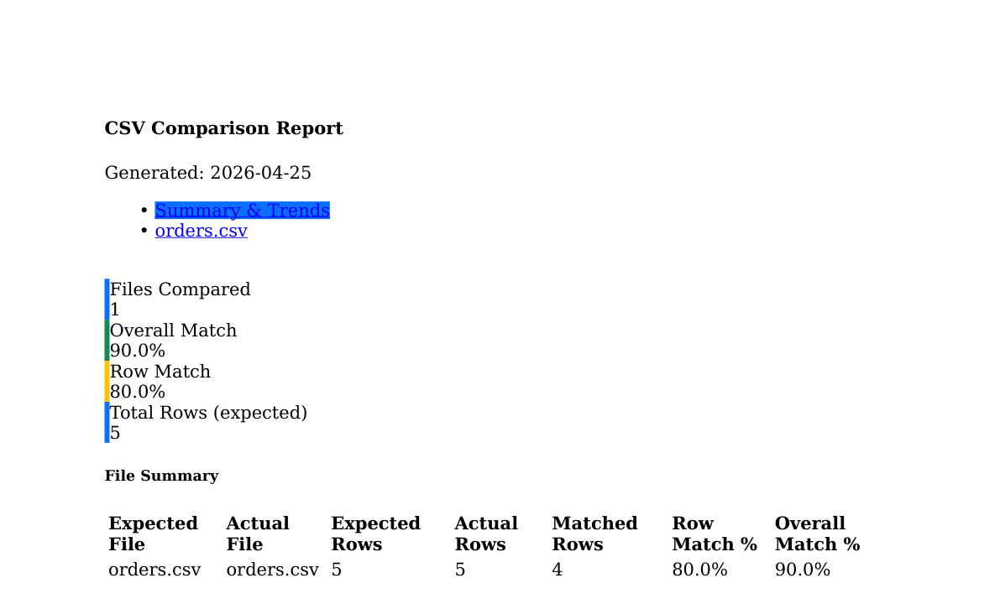
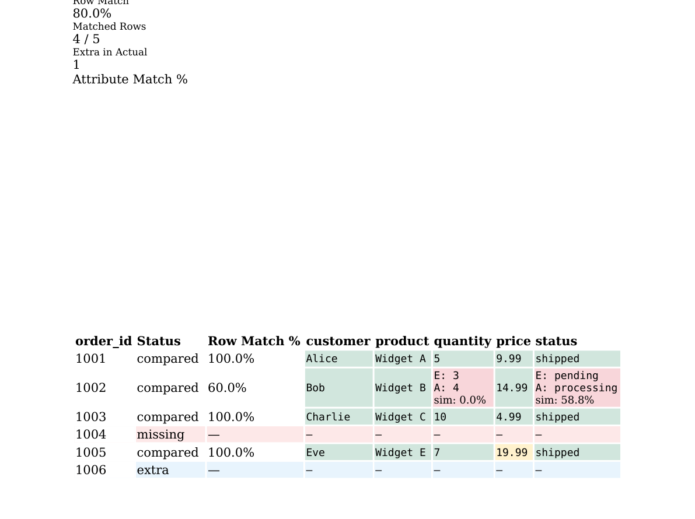

# csv-compare-util

A command-line utility that compares CSV files and produces a self-contained HTML report with color-coded row details, attribute-level metrics, and trend charts across repeated runs.

---

## Features

- **Flexible input** — single file, comma-separated list, or directory for both expected and actual
- **Row-key matching** — joins rows by a configurable key column (e.g. `id`, `order_id`)
- **Fuzzy matching** — configurable similarity threshold so near-matches count as matched
- **Rich HTML report** — per-file tabs, color-coded row detail table, attribute bar charts
- **Trend analysis** — line charts comparing overall match %, row match %, and per-attribute match % across historical runs (enabled by default, opt-out with `--no-history`)

---

## Screenshots

### Summary tab — metric cards + file summary table



> In-browser view also shows interactive trend line charts (Overall Match % and Row Match % over time, and per-attribute trends across runs).

### File detail tab — row-level comparison table



Color coding:

| Color | Meaning |
|---|---|
| Green | Exact match |
| Yellow | Fuzzy match (within threshold) |
| Red | Mismatch (shows `E:` expected / `A:` actual + similarity %) |
| Pink row | Row missing in actual |
| Blue row | Extra row in actual only |

---

## Requirements

- Python 3.10+
- pip packages: `pandas`, `rapidfuzz`, `click`, `jinja2`

---

## Installation

### 1. Clone the repository

```bash
git clone https://github.com/mr-arun-mr/csv-compare-util.git
cd csv-compare-util
```

### 2. (Recommended) Create a virtual environment

```bash
python -m venv .venv
source .venv/bin/activate        # macOS / Linux
.venv\Scripts\activate           # Windows
```

### 3. Install dependencies

```bash
pip install -r requirements.txt
```

### 4. Install the CLI tool (optional)

```bash
pip install -e .
```

This registers the `csv-compare` command globally inside the virtual environment.

---

## Usage

### Basic syntax

```bash
# Using the installed command
csv-compare --expected <expected> --actual <actual> --output <dir> --row-key <col>

# Or without installing
python -m csv_compare.cli --expected <expected> --actual <actual> --output <dir> --row-key <col>
```

### Options

| Option | Short | Required | Default | Description |
|---|---|---|---|---|
| `--expected` | `-e` | yes | — | Expected CSV(s): file, `a.csv,b.csv`, or directory |
| `--actual` | `-a` | yes | — | Actual CSV(s): file, `a.csv,b.csv`, or directory |
| `--output` | `-o` | yes | — | Output directory for the HTML report and history file |
| `--row-key` | `-k` | yes | — | Column name used to match rows (e.g. `id`) |
| `--fuzzy-threshold` | `-f` | no | `100` | Similarity score 0–100; values below 100 allow near-matches |
| `--label` | `-l` | no | timestamp | Label for this run in trend charts |
| `--no-history` | — | no | off | Disable history tracking and trend charts |

---

## Examples

### Compare two single files

```bash
csv-compare \
  --expected data/expected/orders.csv \
  --actual   data/actual/orders.csv \
  --output   reports/ \
  --row-key  order_id
```

### Compare entire directories (files matched by name)

```bash
csv-compare \
  --expected data/expected/ \
  --actual   data/actual/ \
  --output   reports/ \
  --row-key  id \
  --fuzzy-threshold 85
```

### Compare specific files with a run label

```bash
csv-compare \
  --expected baseline.csv,reference.csv \
  --actual   output.csv,result.csv \
  --output   reports/ \
  --row-key  record_id \
  --fuzzy-threshold 90 \
  --label    "Sprint 12 release"
```

### Skip history (one-off comparison, no trend data saved)

```bash
csv-compare \
  --expected expected.csv \
  --actual   actual.csv \
  --output   /tmp/report \
  --row-key  id \
  --no-history
```

---

## Report structure

After each run, `<output>/comparison_report.html` is (over)written and `<output>/comparison_history.json` is appended to.

```
output/
├── comparison_report.html      # self-contained HTML report (open in any browser)
└── comparison_history.json     # cumulative run history for trend charts
```

### Summary & Trends tab

- **Metric cards** — files compared, overall match %, row match %, total rows
- **File summary table** — one row per file pair with sortable metrics
- **Trend charts** — appear automatically once 2+ runs exist:
  - *Overall & Row Match %* line chart over time
  - *Attribute Match % by Column* multi-line chart showing per-column trends

### Per-file tabs

- **Metric cards** — file-level overall match, row match, matched rows, extra rows
- **Attribute bar chart** — match % per column (green ≥ 90%, yellow ≥ 70%, red < 70%)
- **Row detail table** — every row, searchable and paginated:
  - `compared` rows show each cell color-coded
  - `missing` rows (present in expected, absent in actual) highlighted in pink
  - `extra` rows (absent in expected, present in actual) highlighted in blue
  - Mismatched cells show `E: <expected>` / `A: <actual>` and the similarity score

---

## File pairing rules

When comparing directories or comma-separated lists, files are paired **by stem name**:

| Expected | Actual | Paired? |
|---|---|---|
| `expected/orders.csv` | `actual/orders.csv` | yes |
| `expected/users.csv` | `actual/users.csv` | yes |
| `expected/products.csv` | *(absent)* | warning, skipped |

---

## History & Trends

Each run appends one entry to `comparison_history.json`:

```json
{
  "timestamp": "2026-04-25T12:00:00",
  "label": "Sprint 12 release",
  "files_compared": 2,
  "total_rows": 150,
  "overall_match_pct": 94.3,
  "row_match_pct": 96.0,
  "attribute_match_pcts": {
    "name": 98.0,
    "status": 91.2,
    "price": 100.0
  },
  "file_results": [ ... ]
}
```

To reset trends, delete or clear `comparison_history.json`. To skip writing history for a single run without affecting future runs, use `--no-history`.

---

## Project structure

```
csv-compare-util/
├── csv_compare/
│   ├── __init__.py
│   ├── cli.py          # Click CLI entry point
│   ├── resolver.py     # Input → (expected, actual) file pairs
│   ├── comparator.py   # Row-key join + fuzzy cell comparison + metrics
│   ├── history.py      # Append / load comparison_history.json
│   └── reporter.py     # Jinja2 HTML report with Bootstrap + Chart.js
├── docs/screenshots/
├── requirements.txt
├── setup.py
└── sample_report.html  # Example report from a 3-run session
```
